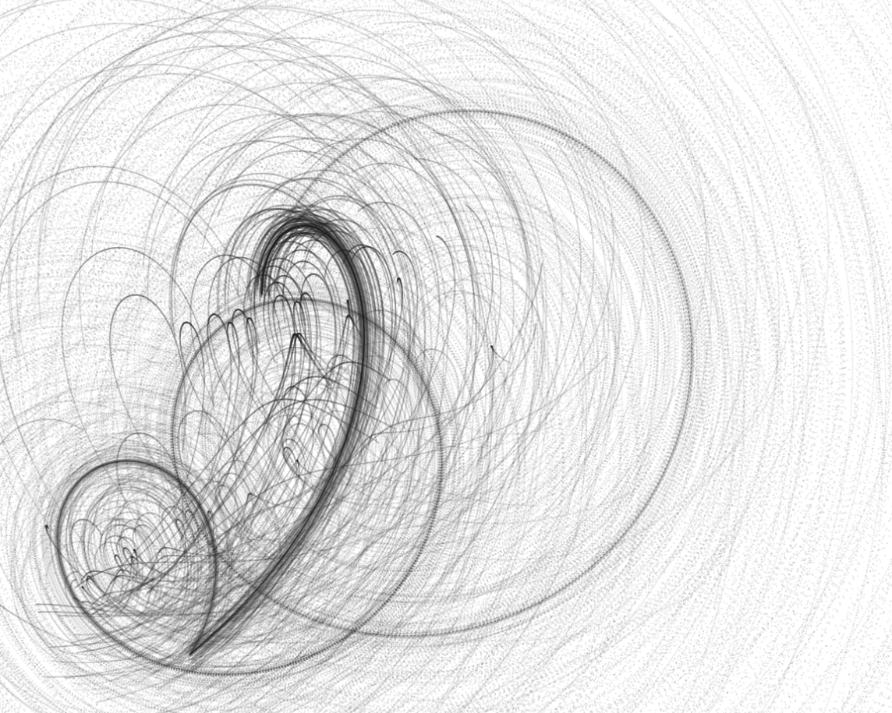

# JS Canvas experiments

Testing some graphics stuff. I usually delete a lot of code in this project if I try something else, in order to see different thing I tried out you'll therefore have to checkout earlier commits.

Traces of Julia Set iterations from a single starting point

Traces of one iteration on a Julia Set from multiple starting points

Aliasing glitches in a mandelbrot

Dragging a point along a random path. The path of the point in front is shown, along with the connection between the two points.